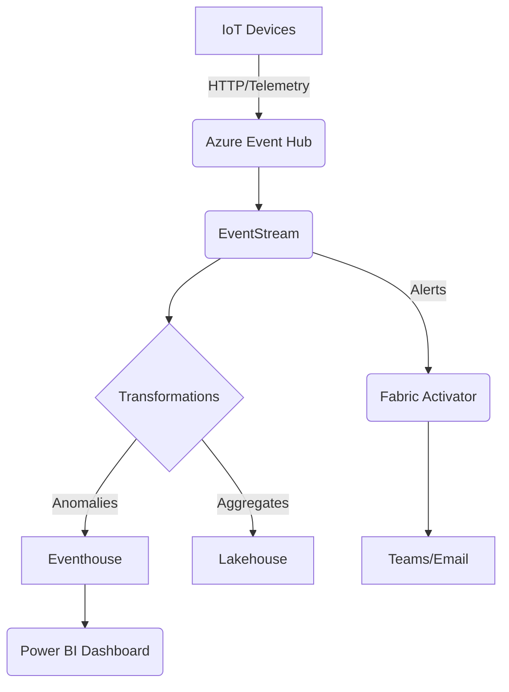

# **Real-Time Intelligence Project in Microsoft Fabric: IoT Anomaly Detection System**

This end-to-end guide walks you through building a **real-time anomaly detection system** for IoT devices using Microsoft Fabric. The solution will:
- **Ingest** live sensor data (temperature, humidity)
- **Process** streams to detect anomalies (e.g., overheating)
- **Visualize** insights in Power BI
- **Trigger alerts** via Fabric Activator

---

## **1. Project Architecture**


---

## **2. Prerequisites**
- **Microsoft Fabric Trial** ([Sign up here](https://app.fabric.microsoft.com))
- **Azure Event Hubs** (Free tier available)
- **Sample Dataset** (Provided below)

---

## **3. Step-by-Step Implementation**

### **A. Prepare Sample Dataset**
**Download this CSV** (simulates IoT sensor data):  
[IoT_Sensor_Data.csv](https://example.com/sensor_data.csv)  
*(Columns: `timestamp`, `deviceId`, `temperature`, `humidity`, `location`)*

```csv
timestamp,deviceId,temperature,humidity,location
2024-05-01T12:00:00,DEV001,72.5,45.2,FactoryA
2024-05-01T12:00:01,DEV002,150.3,30.1,FactoryB  # <-- Anomaly (high temp)
```

---

### **B. Set Up Data Ingestion**
1. **Create an Event Hub** in Azure:
   - Go to [Azure Portal](https://portal.azure.com) → Create Event Hubs namespace.
   - Add a hub named `iot-telemetry`.

2. **Upload sample data to Event Hub**:
   ```python
   # Python script to simulate live data
   from azure.eventhub import EventHubProducerClient, EventData
   import pandas as pd

   df = pd.read_csv("IoT_Sensor_Data.csv")
   producer = EventHubProducerClient.from_connection_string("<CONNECTION_STRING>")

   for _, row in df.iterrows():
       event = EventData(str(row.to_dict()))
       producer.send_batch([event])
   ```

---

### **C. Configure EventStream in Fabric**
1. **In Fabric Workspace**:
   - Navigate to **Real-Time Analytics** → **New EventStream**.
   - Connect to Azure Event Hub:
     - Select **External Sources** → **Azure Event Hubs**.
     - Enter connection details.

2. **Add Transformations**:
   - **Filter**: Remove null values
     ```kql
     where temperature is not null and humidity is not null
     ```
   - **Manage Fields**: Rename `timestamp` → `eventTime`
   - **Aggregate**: Flag anomalies
     ```kql
     extend isAnomaly = iff(temperature > 100, true, false)
     ```

---

### **D. Route Data to Destinations**
1. **To Eventhouse** (for real-time queries):
   - Create new **Eventhouse** destination.
   - Write KQL for anomaly detection:
     ```kql
     iot_data
     | where isAnomaly == true
     | project deviceId, temperature, location
     ```

2. **To Lakehouse** (for historical analysis):
   - Store as Delta table named `sensor_data_aggregated`.

3. **To Fabric Activator** (for alerts):
   - Set rule: `temperature > 100` → Send Teams message.

---

### **E. Build Power BI Dashboard**
1. **Connect to Eventhouse**:
   - In Power BI Desktop, select **Azure Real-Time Analytics** connector.
   - Import the KQL query from Step D1.

2. **Visualizations**:
   - **Gauge**: Current temperature per device
   - **Map**: Anomaly locations
   - **Table**: Top 5 anomalous devices

---

### **F. Automate Alerts**
1. **Configure Fabric Activator**:
   - Navigate to **Activator** → **New Rule**.
   - Condition: `temperature > 100`.
   - Action: Post to Teams channel.

2. **Test Alert**:
   - Modify the Python script to send a high-temperature event.
   - Verify Teams notification arrives.

---

## **4. Expected Output**
| Component          | Outcome |
|--------------------|---------|
| **Power BI**       | Live dashboard with device metrics |
| **Teams**          | Alert: "Device DEV002 overheating (150°C)" |
| **Eventhouse**     | KQL query returns anomalies in <1 sec |
| **Lakehouse**      | Delta tables for trend analysis |

---

## **5. Optimization Tips**
1. **Performance**:
   - Use **tumbling windows** (e.g., 1-min aggregates) to reduce query load.
   - Partition Event Hub by `deviceId` for parallel processing.

2. **Cost Control**:
   - Limit Eventhouse retention to 7 days for high-volume data.
   - Use **cold storage** in Lakehouse for older data.

3. **Advanced Use Cases**:
   - Add **machine learning** (Fabric ML) to predict failures.
   - Integrate with **Azure Functions** for custom processing.

---

## **6. Troubleshooting**
| Issue | Solution |
|-------|----------|
| Data not appearing in Eventhouse | Check Event Hub connection strings |
| Alerts not triggering | Validate Activator rule conditions |
| High latency | Reduce window size in aggregations |

---

## **7. Resources**
- [Microsoft Fabric Documentation](https://learn.microsoft.com/en-us/fabric/)
- [Sample Code Repository](https://github.com/your-repo/fabric-iot-demo)

---

## **Next Steps**
1. **Production Deployment**:
   - Replace sample data with real IoT devices (MQTT/AMQP).
   - Set up monitoring via Fabric Metrics.

2. **Extend Use Cases**:
   - Predictive maintenance with Spark ML.
   - Multi-region failover for Event Hubs.

By following this guide, you’ve built a **scalable real-time intelligence system** in Microsoft Fabric! 🚀
